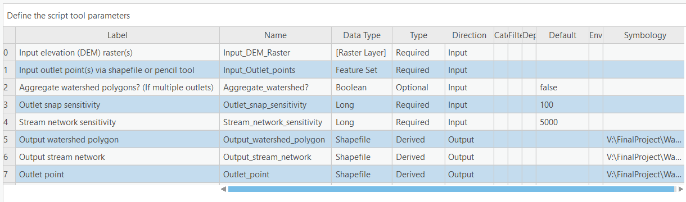

# Watershed & Stream Delineation Tool

This tool allows a user to delineate watersheds and streams using Digital Elevation Model (DEM) raster(s) and outlet point(s) provided as an input in ArcGIS Pro. It can be used to determine the geographical extent of an upstream area which drains into a specific outlet. The tool is built on ArcPy module, an ESRI Python package to extend the functionalities of ArcGIS products. It is suitable for students or professionals, such as hydrologists, researchers and consultants, working on watershed modeling, hydrologic data analysis and/or civil engineering projects.

There are two ways in which outlet(s) (pour points) can be provided to delineate watersheds and streams: 1) user can load their own shapefile containing point feature(s) or 2) user can select point(s) on any base map (for reference) using the pencil tool next to drop down button.  

# How to use the tool?

Go to this [link](https://1drv.ms/u/s!Ak8N6yOD29xEqT4ax-ypDd4LoWWj?e=NgI3S1) to download the zipped ArcGIS Pro workspace. For users who are not interested in downloading the entire workspace, refer to the section `How to configure ArcGIS Pro to run the tool` below.   

Open `Watershed-Stream-Delineation.aprx`. From catalog pane expand `Watershed-Stream-Delineation.tbx` under `Toolboxes`. Right click and select `New` -> `Script` and locate `DelineationTool.py` in the `script` folder. Once it is added, double click `Watershed Stream Delineation Tool`.  

## Inputs

#### Elevation raster(s)

Select a single or multiple Digital Elevation Model (DEM) raster(s). Multiple rasters are automatically joined to create a single raster. DEMs should be selected from your local drive and file path should not contain space character to avoid any errors.

A few example DEMs are provided in the `data` folder for testing purposes. The folder `test_1` has a single DEM for an area in Wake County, NC. The folder `test_2` has 4 DEMs that geographically align next to each other. These can be used to see how multiple DEMs are handled. 

More DEMs can be found at USGS's [National Map](https://viewer.nationalmap.gov/basic/#/) service. 

#### Outlet(s)

An outlet, or a pour point, is a point through which the upstream water drains and flows out of the watershed. There are two ways to load outlet point(s):

1. Load a shapefile containing point feature(s) from your local drive. Make sure the file path has no space characters. Ideally, move your shapefile to `data` folder in the `Watershed-Stream-Delineation-Tool` parent directory.

2. Use the pencil tool located next to the drop down button on the geoprocessing pane for this tool. *Note - Outlet(s) should be located near a stream of flow accumulation*

A few example shapefiles are provided in the `data` folder for testing purpose. The folder `test_1` has a shapefile with a single point feature located in Wake County, NC. The folder `test_2` has a shapefile with 3 point features. This can be used with inputting mutliple DEM rasters.

#### Aggregate watersheds?

If multiple outlets are provided, the user has a choice to either join the watersheds pertaining to each outlet or keep them separate.

If checked, this input will aggregate separate smaller watersheds into 1 big watershed. If left unchecked, all the watersheds will be kept separate as their own polygon features.

If only 1 outlet point is provided, any input for this field will not affect the output.  

#### Outlet snap sensitivity

Specify the distance, in map units, within which the outlet point will be snapped to the pixel with the highest flow accumulation. A default value of 50 units is set. Incrase the magnitude if you are uncertain about the proximity of your point fetures to a flowing stream.

#### Stream network sensitivity

Specify the threshold of flow accumulation that makes up a stream. It is the number of pixels that should flow into 1 pixel to determine a raster of branches that represent the extent of a stream network. For instance, a value of 5000 for stream network sensitivity means that any cell in the flow accumulation raster having a value less than 5000 will not be a part of the delineated stream network. In other words, higher the sensitivity value, lower the branching of streams and lower the number of stream orders. 

## Outputs

The tool outputs three feature layers.

#### Watershed(s) 

This is a feature layer containing polygon(s) of drainage basin(s) that flow into user-specified outlet(s). The symbology layer applied to watershed polygons is provided in `script` folder named `watershed_polygon.lyrx`. If the layer contains more than 1 watershed polygon, `unique value` symbology was used to assign different colors to the delineated watersheds. 

#### Stream network 

This is the feature layer containing a polyline represention of the stream network. The symbology for this feature layer is located in the folder `script` named `stream_feature_clipped.lyrx`. It is a graduated symbol symbology using the `grid code` attribute which gives us the order of a stream. Higher the order of a stream, higher number of inflows from lower ordered stream flowing into it, and thicker the blue line representing the stream.

#### Outlet(s)

This is a layer containing point features. This is the same as the outlet point(s) provided by the user. Symbology is applied for better visualization. The symbology layer is located in the `script` folder named `outlet_project.lyrx`.

# How are folders organized?

The parent directory has 4 main folders that can be of interest to a user:

1. `script` - This folder contains the Python script that made this tool possible. It also contains symbology layers for the output feature layers.

2. `data` - This folder contains 2 sub folders `test_1` and `test_2`. The folder `test_1` contains a raster and a shapefile that can be used to test run this tool for a single DEM and outlet. The folder `test_2` contains 4 rasters and a shapefile with 3 outlet points that can be used to test run and see how this tool handles multiple DEMs and outlets. 

3. `scratch` - This is the deafult workspace set in the Python script for the ArcGIS Pro environment. This folder stores the 3 output feautre layers.

4. `doc` - This folder contains the thumbnail and paramter screenshots and the metadata that can be seen by hovering over question and 'i' symbols in ArcGIS Pro. The metadata is mostly taken from this README file but arranged in a format suitable for displaying metadata in ArcGIS Pro.

# How to configure ArcGIS pro to run the tool?

This section is for users who are only interested in using the .py script in their projects rather than downloading the entire workspace. 

* First create a parent directory and create 4 sub folders, same as mentioned in the folder organization section above. 

* Copy paste the `DeineationTool.py` python script into the `script` folder. 

* Store DEMs and outlet shapefile (if you will not use the pencil tool to draw outlet) in the `data` folder.

* Open and save the project's .aprx file in the parent folder. 

#### Script tool parameters

Open the .aprx file. Right click on this tool in the catalog pane under `Toolboxes` and click on `Properties`. Click on the `Parameters` menu and specify the following parameters in the same order as below:

 

# How does the tool work?

1. Processing DEM raster(s): If a single DEM raster is supplied via file path, the path is converted into a raster object. If multiple DEM rasters are provided, they are combined and projected to a uniform spatial reference (based on the Well-Known ID of the first DEM's coordinate reference system) before being converted to a raster object.

2. Fill: Sinks in the raster are filled to ensure smooth processing in the next steps.  

3. Flow direction: Flow direction is calculated using the elevation values in the raster by applying the D8 method. 

4. Flow accumulation: Flow accumulation is generated based on the flow direction raster.

5. Change outlet CRS: The coordinate reference system (CRS) of outlet(s) feature layer is change to the CRS of the DEM raster.

6. Add an attribute to outlet feature layer: If more than a single outlet is provided, a new column is added to the attribute table of the outlet feature layer that uses a same or unique integer values to agggregate or not aggregate multiple watersheds depending on the user's choice.

7. Snap pour points: Outlet points are snapped to the nearest pixel of highest flow accumulation within a user defined distance.

8. Watershed delineation: Using flow direction and snapped outlet rasters, a watershed is delineated.

9. Raster to Polygon conversion: The watershed raster is converted to polygon feature(s).

10. Conditional statement: A conditional statement is used to specify a user-specified threshold for developing stream network.

11. Stream Order: For applying symbology to show congregated streams in thicker lines, stream order is assigned to each branch of the stream network.

12. Stream to feature: Stream order raster is converted to a feature layer.

13. Clip stream network: The stream network feature layer is clipped to the watershed(s) polygon(s). 

# Notes

Depending on the raster size and your PC performance, it takes anywhere from 2-7 minutes for the tool to delineate watersheds and streams. Once the tool starts to run, the users can check the status of the tool in real time by clicking on `View Details` and scrolling down to navigate to the `Messages` section to see the geospatial processes being applied behind the scenes at that moment.

Coordinate reference systems of all inputs, intermediary files and output are changed to that of the first DEM selected during the user-input stage.